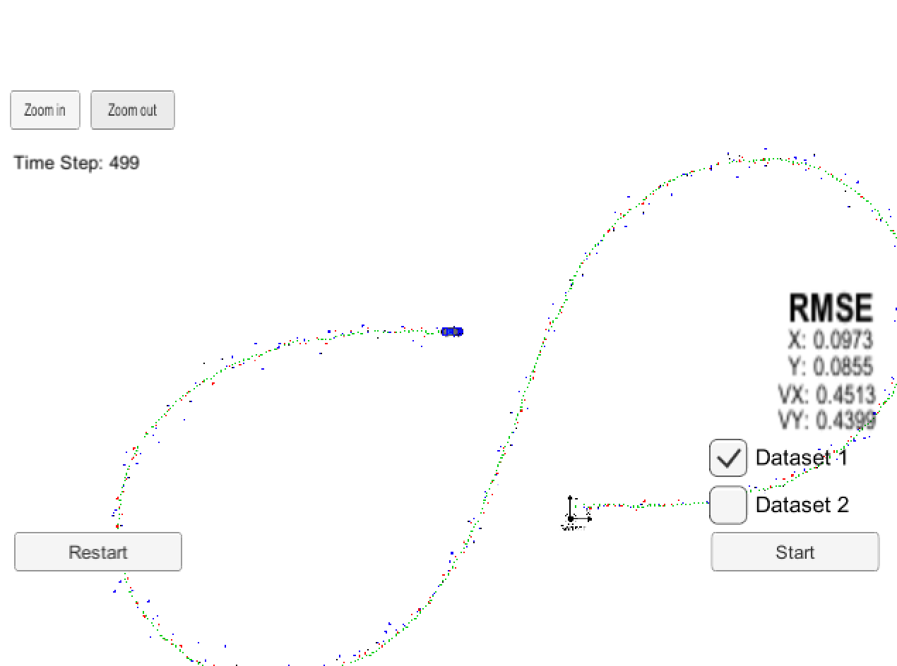
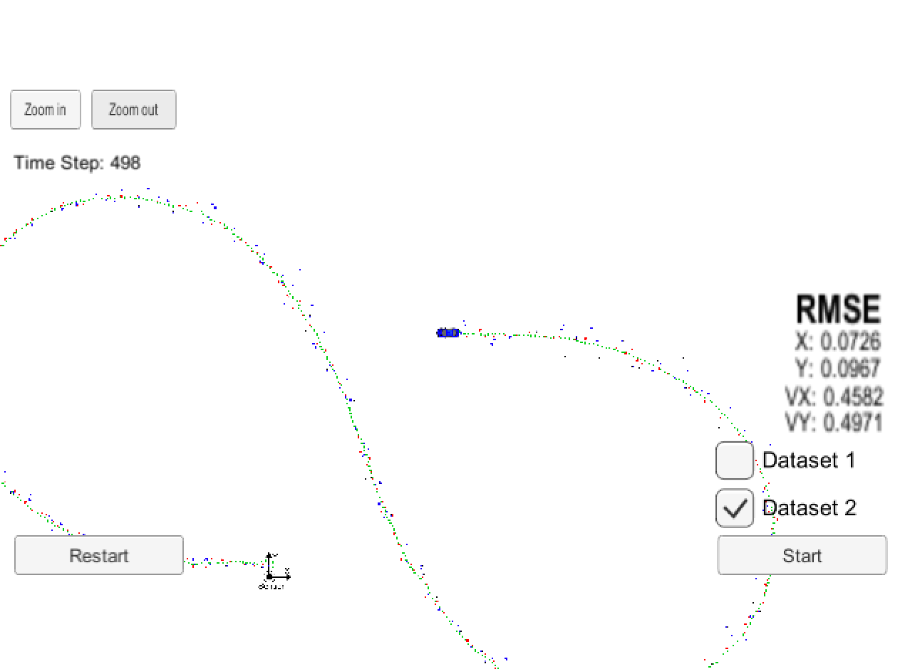

# Extended Kalman Filter Project
In order to estimate the state of a moving object, the Kalman filter algorithm from statistical control theory is introduced and designed around 1960 for aerospace guidance applications. However, Kalman filter is based on linear quadratic estimation which lacks of relevant non-linearity in real-world problems. In order to adopt non-linearity with Lidar and Radar sensor measurements in the context of current self-driving car, this project implemented Extend Kalman Filter,a.k.a EKF, for vehicle control. EKF adapted multivariate Taylor-series expansions to linearize. However, if the initial estimate of the state is wrong, or if the process is modeled incorrectly, the filter may quickly diverge. Despite of drawbacks, EKF is considered de facto standard in the theory of nonlinear state estimation, navigation systems and GPS. 

### Main source code 
1. FusionEKF.cpp, FusionEKF.h, 
2. kalman_filter.cpp, kalman_filter.h, 
3. tools.cpp, and tools.h
4. main.cpp 
---
#### main.cpp
This program is responsible to 
1. communicate with the Term 2 Simulator receiving data measurements
2. call a function to run the Kalman filter
3. call a function to calculate RMSE

This program reads in data from the simulator, parses the data and creates instances of a MeasurementPackage. The simulator is a client, and this program runs as a web server along with uWebSocketIO. Here is the main protocol that main.cpp uses for uWebSocketIO in communicating with the simulator.
*INPUT*: values provided by the simulator to the program
["sensor_measurement"] => the measurement values that the simulator observed (either Lidar or Radar), timestamp and Groundtruth values, which represents the actual path the moving vehicle took,(yaw and yaw rate ground truth values are not used.)
Whereas Radar has three measurements (rho, phi, rhodot), Lidar has two measurements (x, y).
The rest of main.cpp will output the following results to the simulator
*OUTPUT* values
- estimation x, y position: [estimate_x, estimate_y]
- calculated RMSE: [rmse_x, rmse_y, rmse_vx, rmse_vy]

#### kalman_filter.cpp/kalman_filter.h
This program defines the predict function, the update function for lidar, and the update function for radar.
1. initializing Kalman filter variables( x_, P_, F_, H_, R_, Q_)
2. predicting where moving object is going to be after a time step \Delta{t}Δt
3. updating where moving object is based on sensor measurements
Then the prediction and update steps repeat themselves in a loop.
kalman_filter.h defines the KalmanFilter class containing the x vector as well as the P, F, Q, H and R matrices.The KalmanFilter class also contains functions for the prediction step by following kalman filter equations:x=F*x+u, P=FPF^t + Q
Kalman filter update step (lidar) and extended Kalman filter update step (radar).
Because lidar uses linear equations, the update step will use the basic Kalman filter equations:  
* y = Z-(H*x)
* S = H*P*Ht + R
* K = P*Ht*Si
* x = x+ (K*y)
* P= (I- (K*H)) *P

#### FusionEKF.cpp/FusionEKF.h
**ProcessMeasurement()** function is responsible for the initialization of the Kalman filter as well as calling the predict function and the update function of the Kalman filter. 
1. initialize variables and matrices (x, P, F, H_laser, H_jacobian, R_laser, R_radar etc.)
2. initialize the Kalman filter position vector with the first sensor measurements
3. modify the F and Q matrices prior to the prediction step based on the elapsed time between measurements
4. call the update step for either the Lidar or Radar sensor measurement. Because the update step for lidar and radar are slightly different, there are different functions for updating lidar and radar.

Every time main.cpp calls fusionEKF.ProcessMeasurement, the code in FusionEKF.cpp will run. - If this is the first measurement, the Kalman filter will try to initialize the object's location with the sensor measurement.
For Lidar, initialized the object state vector x using reading first element's position (x,y)
[x, y, 0, 0] (px=x,py=y, vx=0, vy=0)
For Radar, used rho(ρ) and phi(ϕ) information to initialize the state variable locations px and py.
[rho * cos(phi), rho * sin(phi), 0,0]
Although radar gives angular velocity data in the form of the range rate ρ˙, a radar measurement does not contain enough information to determine the state variable velocities vx and vy, so sets vx=0, vy=0 same as lidar.

**Predict and Update** Steps in FusionEKF.cpp
Once the Kalman filter gets initialized, the next iterations of the for loop will call the ProcessMeasurement() function to do the predict and update steps.
Since Lidar and Radar should be treated differently, preparing the Q and F matrices are programmed separately in the prediction step.
For laser sensor(Lidar), set ekf object with H_laser and R_laser matrices and then call the measurement Update(line 175-185).
For Radar sensor, set ekf object with H_radar from calculating Jacobian matrix and R_radar matrices and then call the measurement UpdateEKF(line 163-173).

#### tools.cpp/tools.h
function to calculate RMSE and the Jacobian matrix
1. RMSE
To measure how well the Kalman filter performs, RMSE(root mean squared error) is used by comparing the Kalman filter results(estimation list) with the provided ground truth. 
To compute RMSE , the estimation vector size should equal ground truth vector size or the estimation vector size should not be zero
RMSE is computed staring from the residual(the difference between estimates and ground truth value). By multiplying residuals coefficient-wisely and accumulated this value and then calculate its mean and gets the square root of this value. This is RMSE value to return. 
2. Jacobian matrix 
This is for non-linear function 
Check to avoid "division by zero" --> handles error where both the x and y values might be zero or px*px + py*py might be close to zero

---
## Result
### Accuracy  
* For both Dataset1 and Dataset 2 from similar, results are as follows 
* Both cases, [px, py, vx, vy] output  RMSE are less than [.11, .11, 0.52, 0.52]
* both RMSE : < [0.11, 0.11, 0.52. 0.52]

      

[Dataset1 Result](both_Data1_zoomedout.png) [Dataset2 Result](both_Data2_zoomedout.png)

| Data     | (Lidar+Radar) RMSE   |
| -------- | ------ |
| Dataset1 | [0.0973, 0.0855, 0.4517. 0.4399] |
| Dataset2 | [0.0726, 0.0967. 0.4582, 0.4971] |

Tried removing radar or lidar data from the filter. 
step1. single sensor type(Lidar): Radar Turn off
| Data     | (Lidar Only) RMSE   |
| -------- | ------ |
| Dataset1 | [0.1474, 0.1154, 0.6390, 0.5351] |
| Dataset2 | [0.1170, 0.1262. 0.6501. 0.6108 ]|

step2. single sensor type (Radar only) :Lidar turn off 
| Data     | (Radar Only) RMSE   |
| -------- | ------ |
| Dataset1 | [0.2302, 0.3464, 0.5835, 0.8040] |
| Dataset2 | [0.2693, 0.3848. 0.6534, 0.8638] |

Position: Lidar works okay without using Radar (better than Radar only)
Velocity: Lidar works poor without using Radar (Vy better than Rasor only)
Position: Radar works poor without using Lidar
Velocity: Radar works poor without using Lidar (Vx better than Lidar only)
This shows RADAR measurements are tend to be more more noisy than the LIDAR measurements.
Extended Kalman Filter tracking by utilizing both measurements from both LIDAR and RADAR can reduce the noise/errors from the sensor.

#### Kalmain filter variables
	•	VectorXd x;	// object state
	•	MatrixXd P;	// object covariance matrix
	•	MatrixXd F; // state transition matrix
	•	MatrixXd H;	// measurement matrix
	•	MatrixXd R;	// measurement covariance matrix
	•	MatrixXd I; // Identity matrix
	•	MatrixXd Q;	// process covariance matrix
#### Extended Kalman Filter algorithm Summary
1. Initialization
Initialized the position of the state vector based on the first measurements.
Although radar gives velocity data in the form of the range rate ρ˙, a radar measurement does not contain enough information to determine the state variable velocities vx and vy, however, use the radar measurements rho(ρ) and phi(ϕ) to initialize the state variable locations px and py.

2. First predicts then updates
Upon receiving a sensor measurement after a time period Δt, the KF/EKF filter predicts object position to the current timestep and then update the prediction using the new measurement.

3. Radar and Lidar Measurements
sets up the appropriate matrices given the type of measurement and calls the correct measurement function for a given sensor type.
For lidar measurements, the error equation is y = z - H * x'. 
For radar measurements, the functions that map the x vector [px, py, vx, vy] to polar coordinates are non-linear. Instead of using H to calculate y = z - H * x', for radar measurements used the equations that map from cartesian to polar coordinates: y = z - h(x').

#### Improving points 
1. Extended Kalman Filter --> Unscented Kalman Filter 
Extended Kalman Filter uses the Jacobian matrix to linearize non-linear functions; Unscented Kalman Filter, on the other hand, does not need to linearize non-linear functions, instead, the Unscented Kalman filter takes representative points from a Gaussian distribution. These points will be plugged into the non-linear equations.

2. Velocity Model 
In this EKF, constant velocity model is regarded. For better modeling, constant turn rate and velocity magnitude model (CTRV)can be considered. For the CTRV model, two parameters define the process noise: 1)representing longitudinal acceleration noise and 2)representing yaw acceleration noise(angular acceleration).  

3. Rasie Accuracy 
* How to reduce Sensor Noise 
* Apply Unscented Kalman Filter to track non-linear motion more accurately 

---
## Running Environment
### Requirements to run the project
1.Term2 Simulator
This project requires the Term 2 Simulator which can be downloaded [here](https://github.com/udacity/self-driving-car-sim/releases).
The simulator will be using a data file, and feed main.cpp values from it one line at a time.
2.WebSocket Server
It needs to set up and install [uWebSocketIO](https://github.com/uWebSockets/uWebSockets) for either Linux or Mac systems. For windows Docker, VMware, or even [Windows 10 Bash on Ubuntu](https://www.howtogeek.com/249966/how-to-install-and-use-the-linux-bash-shell-on-windows-10/) can be used to install uWebSocketIO.

### Code Style
Followed [Google's C++ style guide](https://google.github.io/styleguide/cppguide.html).

